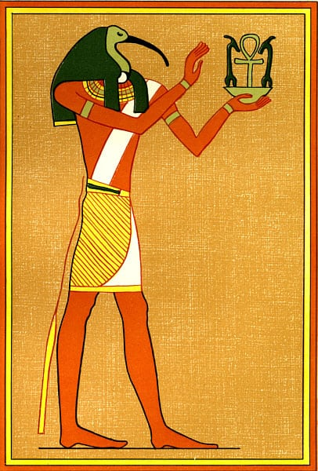

># **Primeiro Projeto: jogo.**

Esse é o primeiro projeto do curso Vamo Aí. O curso possui ênfase em dados e em inteligência artificial. Trata-se de uma parceia do Ifood com a Resília Educação, tendo a duração de seis meses, com projetos reais a cada módulo.

[Meu GitHub](https://github.com/Olavo5?tab=repositories)
> ## **Informações Básicas:**

| Linguagem | Tema | Dados do úsuario|
|:---------:|:-----|:-----------------|
| Python    | Mitologia | Nome e Idade|

> ### **Conteúdo do jogo:**
* *mitología egípcia*  
- *caça ao tesouro* 
+ *charada*
+ *suspense*
* *estilo RPG*

---
---
Ambientação do jogo: 

"Você é um(a) arqueólogo(a) brasileiro(a) e 
ganhou uma bolsa de doutorado da Universidade do Cairo, no Egito,
 com todos os gastos de passagem e moradia e demais despesas 
 por conta do governo egípcio. Um sonho não? No entanto, você nunca se candidatou a tal vaga."

            def local1():

    print(''' Eu sou um número de quatro dígitos.
    O primeiro dígito é 1/2 do último.
    O segundo dígito é três vezes o primeiro. 
    Já o terceiro é o segundo dígito mais três. 
    Multiplique tudo por dois, em que ano eu nasci?''')

    resposta = int(input(': '))
    
    if resposta ...

 :eyes: [Olho de Hórus ](https://br.pinterest.com/pin/821484788255898593/) :eyes:
 -
 ---
 ---

***ATENÇÃO:***

            Algumas aletrações ainda podem ser feitas antes da apresentação do projeto.

:wave: :smiley:
